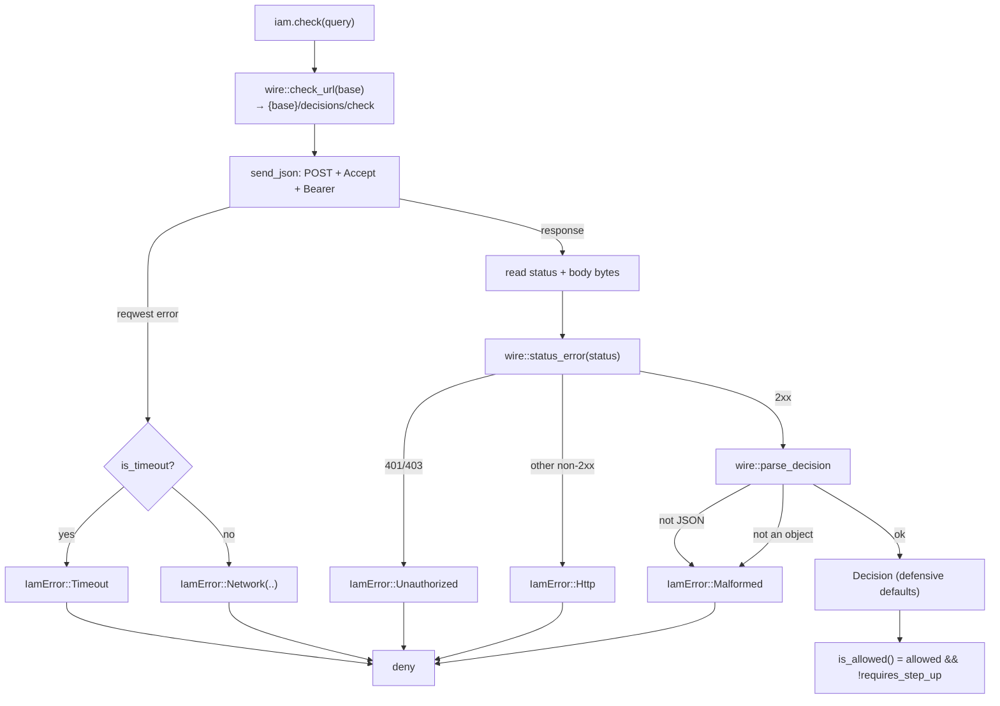
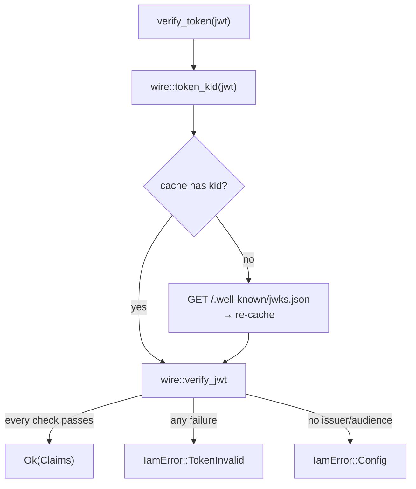

# The check flow

This page traces a single `check()` call end to end — through the async client, the shared `wire` module,
and back — and shows how every failure branch lands on **deny**. The blocking client follows the identical
path minus the `.await`s.

## Motivation

Understanding the exact sequence (and where each `IamError` is produced) makes the fail-closed guarantee
concrete and tells you precisely which error you will see for which failure.

## The pipeline

## Step by step

::: steps
1. **URL construction** — `wire::check_url(&base_url)` returns `{base}/decisions/check` (slash form, the
   real server route).

2. **Send** — `send_json` issues `POST` with `Accept: application/json`, adding
   `Authorization: Bearer <token>` when a token is configured, and the `DecisionQuery` as the JSON body.

3. **Transport errors** — a `reqwest` error is mapped by `map_reqwest_error`: `is_timeout()` →
   [`IamError::Timeout`](/reference/errors), everything else → `IamError::Network(..)`.

4. **Read** — the response status (`u16`) and body bytes are read; a failure reading the body is itself a
   transport error.

5. **Status mapping** — `wire::status_error(status)`: `2xx` → `None` (continue); `401`/`403` →
   `Unauthorized(status)`; any other non-2xx → `Http(status)`.

6. **Parse** — `wire::parse_decision(status, body)` decodes JSON; a non-object body or undecodable bytes
   become `Malformed`. Otherwise `Decision::from_value` applies the [defensive defaults](/concepts/wire-contract).

7. **Collapse** — at the gate, [`ResultExt::is_allowed`](/reference/api) reduces the whole `Result` to one
   `bool`: `true` only for an `Ok(Decision)` that is `granted()`.
:::

## Async vs blocking: same path

The two clients differ only in I/O primitives:

| Concern | async (`client.rs`) | blocking (`blocking.rs`) |
|---|---|---|
| HTTP client | `reqwest::Client` | `reqwest::blocking::Client` |
| JWKS cache lock | `tokio::sync::RwLock` | `std::sync::RwLock` |
| Reading the body | `response.bytes().await` | `response.bytes()` |
| URL / status / parse / verify | `wire::*` (shared) | `wire::*` (shared) |

Because steps 1, 5, 6 (and all of token verification) live in `wire.rs`, both clients produce
**byte-identical** decisions and errors. This is the structural reason the fail-closed semantics cannot
drift between them.

## The JWKS sub-flow (for `verify_token`)

`verify_token()` adds a cache-aware fetch in front of verification:

The cache miss path is what makes **key rotation** transparent — see
[JWT / JWKS verification](/concepts/jwt-verification).

## Gotchas

::: callout warning
- **No retry is built in.** One `check()` is one attempt; if you want backoff, add it deliberately around
  the call (and keep failures as deny).
- **Timeout is per request** and defaults to 2s — a slow server yields `Timeout` → deny, not a hang.
- **The body is fully read** before parsing; very large bodies cost memory. Decision/JWKS payloads are
  small by design.
:::

See also: [Architecture overview](/architecture/overview), [Fail-closed authorization](/concepts/fail-closed).
