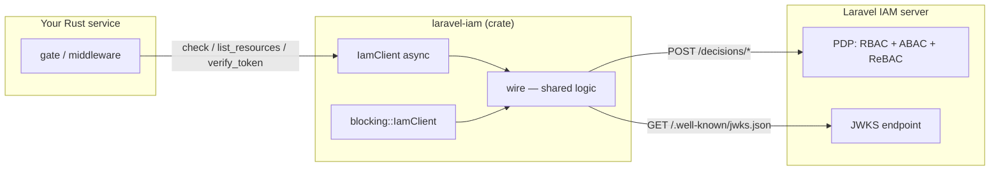

# Architecture overview

This page maps the crate's modules and the boundary between client and server, so you know what each
piece is responsible for and where to look.

## The big picture

The client transports questions and answers; the **server** is the policy authority. The SDK has no
policy logic of its own.

## Module map

The source is small and each module has one job:

| Module | Responsibility |
|---|---|
| `lib.rs` | Crate root, re-exports, the `ResultExt` fail-closed trait, crate-level docs. |
| `client.rs` | The async `IamClient` (`reqwest` + `tokio`), JWKS cache, `reqwest`-error mapping. |
| `blocking.rs` | The synchronous `blocking::IamClient` (feature-gated), same shape on `reqwest::blocking`. |
| `wire.rs` | **Transport-agnostic** logic: URL construction, status mapping, response parsing, JWT verification. |
| `config.rs` | `Config` + `IamClientBuilder` (validation, defaults). |
| `types.rs` | Wire types: `Subject`, `Resource`, `DecisionQuery`, `Decision`, `Claims`. |
| `error.rs` | `IamError` — the fail-closed error taxonomy. |

## The transport-agnostic core

The defining structural choice is that everything which does **not** depend on *how bytes move* lives in
`wire.rs`:

- `check_url` / `list_resources_url` / `jwks_url` — endpoint construction.
- `status_error` — HTTP status → `IamError` (or `None` for 2xx).
- `parse_decision` / `parse_resources` / `parse_jwks` — defensive parsing.
- `token_kid` / `verify_jwt` — JWT verification with `p256`.

Both `client.rs` and `blocking.rs` are thin shells that do I/O and then hand bytes to `wire.rs`. This is
why the async and blocking clients can never drift in their semantics — they share the decision logic.
See [The check flow](/architecture/check-flow).

## The builder

`IamClientBuilder` (in `config.rs`) is shared by both clients. It collects `base_url`, `token`,
`timeout`, `issuer`, `audience`, validates on `finish()` (a non-empty `base_url` is required; the trailing
slash is trimmed), and is finished with:

- `build()` → async `IamClient`
- `build_blocking()` → `blocking::IamClient` (feature `blocking`)

Defaults: `timeout = 2s`. `issuer`/`audience` are optional for `check()` but **required** for
`verify_token()`.

## Trust boundaries

::: steps
1. **Service-to-IAM (decisions).** The SDK authenticates to the server with a Client-Credentials service
   token (`Authorization: Bearer`). The server makes the policy decision.

2. **Token verification (consumer side).** Trust in an end-user JWT is anchored in the server's signing
   key, fetched via JWKS and cached. The SDK verifies signatures locally; it does not phone home per
   token.

3. **Fail-closed everywhere.** Any break in either boundary — unreachable server, rejected credentials,
   bad signature — collapses to deny. See [Fail-closed authorization](/concepts/fail-closed).
:::

## What is *not* here

- **No policy evaluation** — roles, attributes, relationships all live server-side.
- **No token issuance** — the SDK only verifies; the server issues.
- **No caching of decisions** — only the JWKS is cached; every `check()` is a fresh server decision.
- **No retries** — a failure is a deny; deliberate retry/backoff is the caller's choice.

See also: [The check flow](/architecture/check-flow), [Decision records](/architecture/decisions),
[The wire contract](/concepts/wire-contract).
