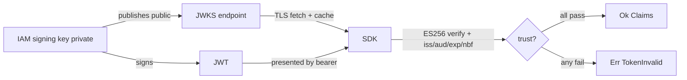

# Security

The SDK is a security control; this page collects the properties it guarantees and the obligations that
remain yours.

## What the SDK guarantees

::: callout success
- **Fail-closed transport.** Any error — network, timeout, `4xx`, `5xx`, malformed body — is a deny.
  There is no fail-open switch. ([Fail-closed authorization](/concepts/fail-closed))
- **Algorithm pinning.** Token verification accepts **only** `ES256`; `none`/`RS256`/`HS256` are
  rejected, defeating algorithm-confusion attacks.
- **Signature before claims.** The ECDSA signature is verified before any claim is parsed or trusted.
- **Mandatory issuer & audience.** `verify_token()` without both configured returns `IamError::Config`,
  never a pass.
- **No clock leeway.** `exp`/`nbf` are checked strictly.
- **`#![forbid(unsafe_code)]`.** The crate contains no `unsafe`; verification is pure-safe Rust over
  `p256`.
- **Step-up respected.** `allowed + requires_step_up` is treated as *not yet allowed*.
:::

## Your obligations

::: steps
1. **Protect the service token.** The Client-Credentials token sent as `Authorization: Bearer` is a
   secret. Load it from the environment or a secrets manager — never hard-code or log it. Rotate it
   periodically.

2. **Use TLS to the IAM server.** `base_url` must be `https://`. The SDK uses `native-tls`; do not
   terminate TLS before the server in a way that exposes the token or decisions on the wire.

3. **Keep clocks synced.** Because verification has zero leeway, run NTP so a correct token is not
   rejected (and an expired one is).

4. **Set issuer & audience to the real values.** A too-broad `aud` weakens the audience check. Use the
   specific audience your service is the intended recipient of.

5. **Treat `Unauthorized` as an alert.** `IamError::Unauthorized` on `check()` means **your** service
   token was rejected — investigate, don't silently deny forever.

6. **Don't log secrets or tokens.** Log `decision_id` / `policy_version` for audit, not the JWT or the
   service token.
:::

## Threats and how the design addresses them

| Threat | Mitigation |
|---|---|
| Forged token (tampered payload) | ECDSA signature verified before claims; tamper → `TokenInvalid`. |
| `alg: none` / algorithm confusion | `alg` pinned to `ES256`; anything else rejected. |
| Replaying an expired token | Strict `exp` check, no leeway. |
| Token for another service | `aud` must match the configured audience. |
| Token from a rogue issuer | `iss` must match the configured issuer. |
| Key rotation gap | JWKS re-fetched on unknown `kid`; old keys still present verify old tokens. |
| IAM outage flipping gates open | Fail-closed: outage → deny, never allow. |
| Stale/poisoned JWKS | Fetched over TLS from the server's well-known endpoint; cached per process. |

## Token verification trust chain

Trust flows from the server's private key, never from the token's self-asserted contents.

## Defense in depth

The SDK is one layer. Keep authorization decisions on the server, keep the audit trail server-side
(tamper-evident on the IAM server), and do not reconstruct policy logic on the client — a thin client is
also a smaller attack surface.

::: callout warning
The SDK verifies tokens and transports decisions; it does **not** issue tokens, revoke sessions, or store
secrets for you. Those are the server's and your platform's responsibilities.
:::

See also: [JWT / JWKS verification](/concepts/jwt-verification), [Verifying tokens](/guides/verifying-tokens),
[Architecture decision records](/architecture/decisions).
