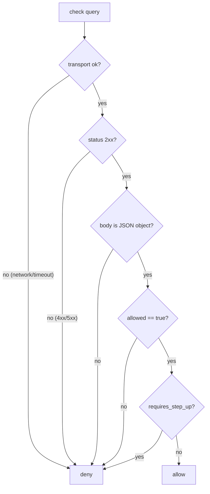

# Fail-closed authorization

Fail-closed is the organizing principle of this SDK. This page makes the argument formally, shows how the
crate encodes it in the type system, and explains the one place where you may deliberately deviate.

## Motivation

An authorization check has two failure modes when something goes wrong (a timeout, a `500`, a garbled
body):

- **Fail-open** — treat the failure as *allow*. The system stays available, but the security boundary
  silently disappears exactly when the infrastructure is already unhealthy.
- **Fail-closed** — treat the failure as *deny*. The boundary holds; availability of the protected action
  degrades.

For a security control, fail-open is the catastrophic mode: an attacker who can induce errors (or a mere
outage) gets unrestricted access. This SDK is fail-closed everywhere, with **no** fail-open switch in the
transport.

## Theory: the decision function

Model a gate as a function over outcomes. Let the set of outcomes be

$$
\Omega = \{\, \texttt{permit},\ \texttt{deny},\ \texttt{step\_up},\ \texttt{error} \,\}
$$

The fail-closed gate is the indicator function

$$
\text{allow}(\omega) =
\begin{cases}
1 & \omega = \texttt{permit} \\
0 & \omega \in \{\texttt{deny},\ \texttt{step\_up},\ \texttt{error}\}
\end{cases}
$$

The safety property is simply: $\text{allow}(\omega) = 1 \implies \omega = \texttt{permit}$. There is no
outcome other than an explicit server permit that opens the gate. In particular every error and every
pending step-up maps to $0$.

This is exactly [`ResultExt::is_allowed`](/reference/api):

```rust
impl ResultExt for Result<Decision, IamError> {
    fn is_allowed(&self) -> bool {
        matches!(self, Ok(decision) if decision.is_allowed())
    }
}
```

where `Decision::is_allowed()` is `granted()` = `allowed && !requires_step_up`.

## How the crate enforces it

::: steps
1. **Fallible operations return `Result`.** `check()` returns `Result<Decision, IamError>`; there is no
   API that yields a bare `bool` from the network.

2. **Every error variant means "could not obtain a permit".** The [`IamError`](/reference/errors) doc
   comment states it outright: *"None of these ever mean allow."* `Network`, `Timeout`, `Unauthorized`,
   `Http`, `Malformed`, `TokenInvalid`, `Config` — all deny.

3. **The collapse is a single helper.** `ResultExt::is_allowed` turns the whole `Result` into one
   `bool`, so callers cannot forget a variant.

4. **Defensive parsing.** Even a *successful* HTTP 200 is denied if `allowed` is missing or not the
   boolean `true`, or if the body is not a JSON object. See [The wire contract](/concepts/wire-contract).

5. **Step-up is not allow.** An `allowed` decision that still `requires_step_up` is *not* `granted()`.
:::



Every branch except the single rightmost path leads to **deny**. That is fail-closed made visual.

## The test discipline

The crate's own suite asserts this for *every* path: a 500, a 400, a 401, a 403, a malformed body, a
non-object body, a missing `allowed`, a network error, and a timeout are each checked to produce
`is_allowed() == false`. The step-up case is checked to be `allowed` yet **not** `granted()`. Fail-closed
is not a comment — it is a row in the test matrix for each error.

## ADR: why no fail-open switch

::: collapsible "ADR-0000 — No fail-open configuration flag"
**Problem.** Operators sometimes ask for a "degrade open on outage" toggle so users aren't blocked when
IAM is down.

**Decision.** The SDK ships **no** such flag. The transport is always fail-closed. Outage tolerance, if
genuinely required, is implemented explicitly at the application layer for specific low-risk actions.

**Consequences.**
- ✅ A misconfiguration or partial outage can never silently open every gate.
- ✅ The safe default requires zero configuration and cannot be left in an unsafe state.
- ⚠️ Teams that want degradation must write it themselves, visibly and per-action (see
  [Fail-closed patterns](/guides/fail-closed-patterns)) — which is the point: it should be a deliberate,
  reviewed decision, not a global switch.
:::

## When fail-closed is *too* strict

The one defensible deviation is a specific, low-risk action that must remain usable during an IAM
**outage** (a `Timeout`/`Network` error — never a `4xx`, `Malformed`, or token error, which are denials,
not outages). Do it explicitly, scoped, logged, and owned at the application layer. The recipe is in
[Fail-closed patterns → deliberate outage tolerance](/guides/fail-closed-patterns).

::: callout warning
Never degrade open for a security-sensitive action, and never collapse a non-outage error into allow.
When in doubt, deny.
:::

See also: [Core concepts](/core-concepts), [Error taxonomy](/reference/errors).
