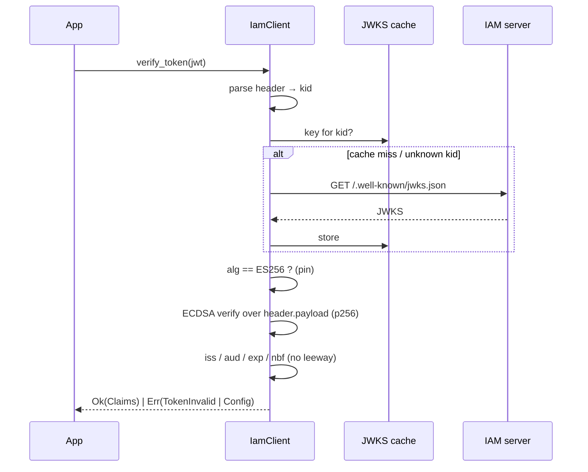

# JWT / JWKS verification

`verify_token()` establishes trust in an OIDC token by checking its **ES256** signature against the IAM
server's published keys and then validating the registered claims — all locally, in pure-Rust crypto.
This page is the theory; the how-to is in [Verifying tokens](/guides/verifying-tokens).

## Motivation

A JWT is a string the bearer hands you; its payload is self-asserted and trivially forgeable until you
verify the signature. Verification anchors trust in the IAM server's **private** signing key: only tokens
signed by that key, and not yet expired, for the right audience, are accepted.

## Background: the JOSE objects

| Object | What it is |
|---|---|
| **JWT** | `base64url(header).base64url(payload).base64url(signature)` |
| **JWS header** | `{ "alg": "ES256", "kid": "<key id>" }` |
| **JWKS** | a set of public keys at `{base}/.well-known/jwks.json`; each EC key has `kty`, `crv`, `kid`, `x`, `y` |
| **ES256** | ECDSA over the NIST **P-256** curve with SHA-256 |

The server signs with the EC private key; the JWKS publishes the matching public key as the affine
coordinates $(x, y)$, base64url-encoded.

## The verification pipeline

## The checks, formally

A token is accepted **iff every** predicate below holds. Any single failure is
[`IamError::TokenInvalid`](/reference/errors); a missing issuer/audience config is `IamError::Config`.

::: steps
1. **Structure.** Exactly three `.`-separated segments, each valid base64url (no padding).

2. **Algorithm pinning.** `header.alg == "ES256"`. Any other value — including `none`, `RS256`, `HS256`
   — is rejected outright. This defeats algorithm-confusion attacks where a token claims a symmetric or
   `none` algorithm to bypass the public-key check.

3. **Key resolution.** `header.kid` must name a key in the JWKS. The JWK must be `kty == "EC"` and
   `crv == "P-256"`; `x` and `y` must each decode to **32 bytes**. The key is reconstructed as the SEC1
   uncompressed point `0x04 ∥ X ∥ Y` and loaded with `p256::ecdsa::VerifyingKey::from_sec1_bytes`.

4. **Signature.** ECDSA verification of the signature over the ASCII bytes of `header.payload`, **before**
   any claim is parsed or trusted.

5. **Claims, no leeway** (see below).
:::

## Claim validation (no leeway)

Let `now` be the current Unix time in seconds. With configured `issuer` and `audience`:

- `iss == issuer` (exact string match).
- `aud` **matches** `audience`: per RFC 7519, `aud` may be a single string or an array; the predicate is
  $\exists\, a \in \text{aud} : a = \text{audience}$ (or `aud == audience` for the scalar form).
- **Not expired:** `now < exp`. The check is strict — `now >= exp` is expired.
- **Not premature:** if `nbf` is present, `now >= nbf`.

There is deliberately **zero** clock skew tolerance. Keep clocks synced with NTP.

::: callout warning
Issuer and audience are **mandatory**. `verify_token()` called on a client built without both returns
`IamError::Config`, never an accepted token. A token the client cannot fully validate must never be
trusted — this is enforced at the top of `wire::verify_jwt`.
:::

## Why pure-Rust crypto (p256)

Signature verification uses [`p256`](https://crates.io/crates/p256) from the RustCrypto project rather
than the C-backed `jsonwebtoken` → OpenSSL path. The trade-off is recorded in
[ADR-0001](/architecture/decisions); in short: no C toolchain, no OpenSSL to link, trivial
cross-compilation and container builds, at the cost of depending on a pure-Rust ECDSA implementation.

## Key rotation

The JWKS is cached per client instance. When a token presents a `kid` the cache does not contain, the SDK
re-fetches the JWKS once and re-caches it. Rotation is therefore handled by **key id**, transparently —
there is no TTL and no per-request fetch. Publish the new key (new `kid`) before you start signing with
it and old tokens keep verifying against the still-present old key.

## Gotchas

::: callout warning
- **Both `issuer` and `audience` required** — else `IamError::Config`.
- **ES256 only** — by design; the server signs with EC P-256.
- **No leeway** — a one-second-expired token is rejected.
- **Signature is checked before claims** — you can never act on the payload of an unverified token.
:::

See also: [Verifying tokens](/guides/verifying-tokens), [Security](/best-practices/security),
[ADR-0001](/architecture/decisions).
