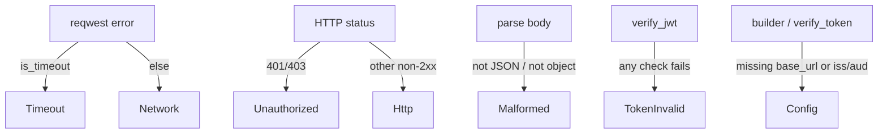

# Error taxonomy

`IamError` is the single error type returned by every fallible operation. Its defining property, stated in
its own doc comment, is: **none of these variants ever mean "allow"**. A caller that turns any `IamError`
into anything other than a denial has broken the fail-closed guarantee.

## The enum

```rust
#[derive(Debug, Clone, Error)]
#[non_exhaustive]
pub enum IamError {
    Network(String),     // transport failure (connection/DNS/TLS/broken pipe)
    Timeout,             // request didn't complete within the timeout
    Unauthorized(u16),   // server rejected the service credentials (401 / 403)
    Http(u16),           // other non-2xx status
    Malformed(String),   // 2xx body couldn't be parsed into the expected shape
    TokenInvalid(String),// JWT failed verification
    Config(String),      // client misconfigured for the operation
}
```

It derives `thiserror::Error` (so it implements `std::error::Error` + `Display`) and `Clone`, and is
`#[non_exhaustive]` — always include a wildcard arm when matching.

## Variants in detail

| Variant | `Display` | Produced when | Treat as |
|---|---|---|---|
| `Network(String)` | `network error: {0}` | connection refused, DNS, TLS, broken pipe — any non-timeout `reqwest` error | **deny** |
| `Timeout` | `request timed out` | the request exceeded the configured timeout | **deny** |
| `Unauthorized(u16)` | `unauthorized (HTTP {0})` | server returned `401` or `403` (your service token) | **deny** + alert |
| `Http(u16)` | `server returned HTTP {0}` | any other non-2xx (e.g. `404`, `500`) | **deny** |
| `Malformed(String)` | `malformed response: {0}` | a 2xx body that isn't a JSON object / can't be parsed | **deny** |
| `TokenInvalid(String)` | `token verification failed: {0}` | bad signature, wrong alg, expired, wrong `iss`/`aud`, unknown `kid`, malformed JWT | **reject token** |
| `Config(String)` | `client configuration error: {0}` | empty `base_url`; `verify_token` without issuer/audience | **fix config** |

## Where each comes from



`Network`/`Timeout` come from `map_reqwest_error`; `Unauthorized`/`Http` from `wire::status_error`;
`Malformed` from the parsers; `TokenInvalid`/`Config` from `wire::verify_jwt` and the builder.

## Matching idioms

The safe gate never needs to match — use [`ResultExt::is_allowed`](/reference/api), which maps every
variant to `false`:

```rust
use laravel_iam::ResultExt;
let allowed = iam.check(q).await.is_allowed(); // any error → false
```

When you need to react differently (observability, retries, surfacing config bugs), match — and always
keep a deny default:

```rust
use laravel_iam::IamError;

match iam.check(q).await {
    Ok(d) if d.granted()           => allow(),
    Ok(_)                          => deny(),                 // explicit policy deny / step-up
    Err(IamError::Unauthorized(_)) => { alert("bad service token"); deny() },
    Err(IamError::Config(_))       => { alert("misconfigured client"); deny() },
    Err(_)                         => deny(),                 // Network/Timeout/Http/Malformed
}
```

::: callout danger
Never write an arm that maps an `Err` to *allow*. The whole point of the taxonomy is that every variant is
a denial. The only legitimate, narrow exception is a deliberately scoped outage-tolerance policy for
`Timeout`/`Network` on a low-risk action — see [Fail-closed patterns](/guides/fail-closed-patterns).
:::

## `Unauthorized` is about *your* credentials

A common confusion: `IamError::Unauthorized` does **not** mean the end user lacks permission (that is
`Ok(Decision { allowed: false })`). It means the server rejected **your service token** (`401`/`403`).
Treat it as an operational alert, not a user-facing 403.

See also: [Fail-closed authorization](/concepts/fail-closed), [Troubleshooting](/operations/troubleshooting),
[API reference](/reference/api).
